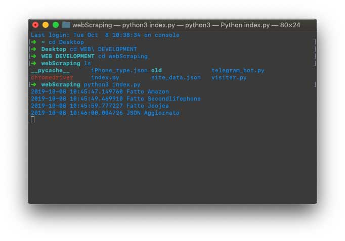
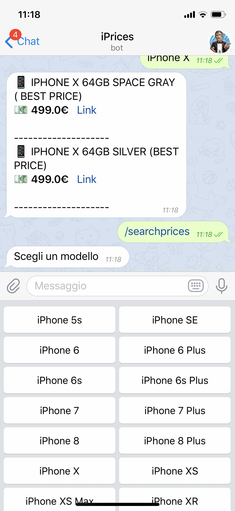

# Custom webscraping for italian iphones ecommerce
This project is composed by 2 main files:
* The index.py that when compiled get the name, the price and a link of all iphones searching on the code of the web pages provided in the site_data.json
* A custom bot for telegram that helps you keep tracking of all the prices of the iphones you choose

# Steps to follow to get it working
1. Download and insert in the same directory of the project chrome webdriver (choose your version [Here](https://chromedriver.chromium.org/downloads))
1. Insert your telegram token (google is your friend, is pretty straightforward to generate one [search tip: The Bot Father]) and insert it in the telegram_bot.py file in the "TOKEN" variable
1. Compile index.py, will be created a json with all the useful data in the scraped pages
1. Compile telegram_bot.py, is needed to handle all the requests.
1. Open telegram and have fun with your bot 

## Remember
This is a project made for fun (and to learn something new) few months ago, is still very raw, i have lot of new ideas to improve it, but for now I can't spend more time on it... By the way any suggestion is well accepted :)

## Screenshots

  
 

